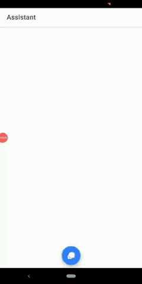

# My Vocal Assistant
This project is a vocal assistant created using Google DialogFlow and Ionic Angular.
I created also a simple [guide]() related at this project.

## Installation
The app needs to DialogFlow agent to work, you can follow the first part of my simple guide on [medium.com]() to create one.

When your agent is working, you need to copy your API_KEY in `environments/environments.ts` file like follwing:
```
export const environment = {
  production: true,
  dialogflow: {
    angularBot: '_API_KEY'
  }
};
```
## Running

To deploy and run app on android device you should  execute:

```ionic cordova run android --prod --release```

as reported in the official [guide](https://ionicframework.com/docs/building/running).

## Usage
To use app you just need to ask something and the app will speech with bot response.

Also, you can use the bot response to execute an action like open pages.

To do it, you need to define an action in the intents on DialogFlow.

## Demo



## Contributing

Pull requests are welcome. For major changes, please open an issue first to discuss what you would like to change.

## License

[MIT](LICENSE)


